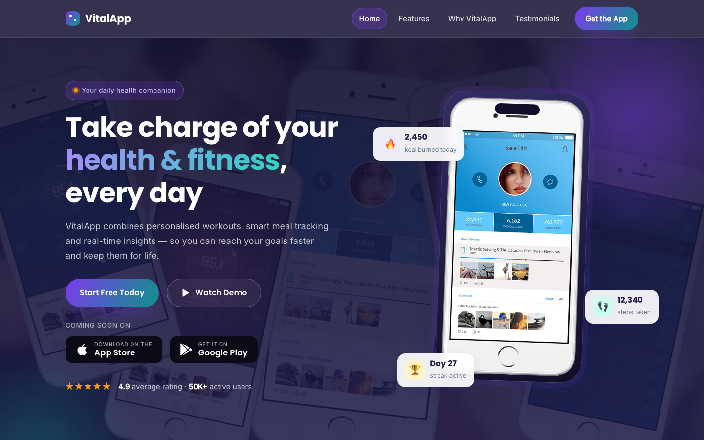

# 💪 VitalApp — Mobile Fitness & Diet App Landing Page

A premium, single-page HTML landing template for **VitalApp**, a health and fitness mobile application. Built with pure HTML5, CSS3, and vanilla JavaScript — no frameworks, no build tools.

---

## 📸 Screenshot

## 🎨 Design System

| Token | Value | Usage |
|-------|-------|-------|
| `--purple` | `#7C3AED` | Primary accent, icon badges, hover states, gradient base |
| `--teal` | `#0D9488` | Secondary accent, gradient partner, soft highlights |
| `--indigo` | `#1E1B4B` | Hero background, dark section fills, heading colour |
| `--light` | `#F8FAFC` | Section backgrounds, testimonial & feature card areas |
| `--accent` | `#F59E0B` | Star ratings, notification chips, special badge highlights |
| `--grad-brand` | `linear-gradient(120deg, #7C3AED, #0D9488)` | Primary buttons, nav CTA, logo mark, icon fills |
| `--font-head` | `'Poppins', sans-serif (600/700)` | All headings, buttons, nav logo |
| `--font-body` | `'Inter', sans-serif (400/500)` | Body copy, paragraphs, labels |

## 📄 Pages

| Page | Description | Sections |
|------|-------------|----------|
| [index.html](index.html) | Full single-page landing site | Hero, Features, Why VitalApp, Testimonials, Download CTA, Footer |
| [404.html](404.html) | Custom error page | Page hero, 404 content, Footer |

## ⚙️ Tech Stack

- **HTML5** — semantic, accessible markup
- **CSS3** — custom properties, Flexbox, Grid, clamp(), backdrop-filter, animations
- **Vanilla JS** — Intersection Observer scroll reveals, sticky nav, mobile toggle, smooth scroll, back-to-top, form validation, footer year
- **Google Fonts** — Poppins (headings) + Inter (body) via preconnect + stylesheet
- **Emoji favicon** — inline data:image/svg+xml, no external dependency

## 📁 Images

All images are located in `assets/img/`. The template uses 16 original source images:

- `screenshot-1.png` to `screenshot-5.png` — phone UI screenshots for hero mockup and feature cards
- `testimonial-1.jpg` to `testimonial-4.jpg` — testimonial user avatars
- `app-1.png`, `app-2.png` — phone mockup visuals for the download CTA section
- `app-landing-page.jpg` — dashboard preview in the "Why VitalApp" device collage
- `feature.png` — phone feature detail in the "Why VitalApp" section
- `header-bg.jpg` — subtle background texture for the hero section
- `logo.png` — brand logo in the footer
- `owl.video.play.png` — play icon reference (not used in this template)

---

**Template by uiuxlabz** — framework-free, responsive, production-ready.

---

### Let's Build Something Together 🚀

[https://tally.so/r/q4q1L9](https://tally.so/r/q4q1L9)